# Black Girls Code Webpage in a Day

### Table of Contents
**[Web Design Steps](#web-design-steps)** 
**[Part One: Start Project in Glitch](#part-one-start-project-in-glitch)** 
**[Part Two: Start Building Website](#part-two-start-building-website)** 
**[Part Three: Create Multiple Pages](#part-three-create-multiple-pages)** 
**[Part Four: Javajam Challenge](#part-four-javajam-challenge)** 
**[Part Five: Trillium Mini Challenge](#part-five-trillium-mini-challenge)** 
**[Part Six: Classes and IDs](#part-six-classes-and-ids)** 
**[Part Seven: JavaJam Challenge Part II](#part-seven-javajam-challenge-part-ii)** 

Open [this link](https://www.w3schools.com/html/html_basic.asp) in a new tab by right clicking on the blue text and then selecting `Open Link in New Tab`. W3Schools is a great resource to learn about web development.

## Web Design Steps

#### Determine the intended Audience
- The colors, images, and layout should be tailored to the preferences of your audience. The type of site content (reading level, amount of animation, etc.) should be appropriate for your chosen audience.
#### Determine the Goals of the Site
- Some common goals of web sites are: to be informative, to create a personal home page, to establish a corporate web presence, and to do business in e-commerce.
#### Determine  the General Content and Create a Site Map
- The Site Map is sometimes called a Storyboard. Common organizational structures for Web sites are: hierarchical, linear, and random.
#### Sketch a Tentative Layout Page
- Be consistent in your overall layout- color, typefaces, logo location, navigation bar, etc. Plan your Home Page Layout to avoid scrolling. Plan your Content Page Layout to be consistent, with easy navigation.

## Part One: Start Project in Glitch

1. Open [this link](https://glitch.com/~jd12-bgc-webpage-in-a-day) 

2. Sign in to Glitch so that you can save your progress.

3. Click `Remix this Project` 

4. Open the `index.html`. It should look like this.

5. Test the website by adding your name to the `div` section.

6. See your page by clicking on Show in the top toolbar.

## Part Two: Start Building Website

1. Modify the title of the web page [the text that appears in the tab] by changing the text between the `<title>` and `</title>` tags to `Trillium Media Design` like so: 

2. Position your cursor in the body section and code the header element with the text, "Trillium Media Design" in an h1 element element like so:  

3. Code a nav element to contain text that will indicate the main navigation for the website. Configure bold text using the b element and use the `&nbsp` special character (which stands for Nonbreaking space) to add extra blank space like so:  

4. Code the content within a div element that contains the h2 and paragraph elements. 

5. Configure the footer element to contain a copyright notice displayed in small font size and italic font. Be careful to properly nest the elements as shown here: 

Replace "Your Name Here" with your actual name. 

6. Compare your site to the below image and make any tweaks. 

## Part Three: Create Multiple Pages

Many websites have multiple websites associated with it. We are going to create multiple websites associated with our website and link them. 

1. The navigation hyperlinks will be located within the nav element. You will edit the code within the nav element to configure three hyperlinks. 
  - The text "Home" will hyperlink to index.html
  - The text "Services" will hyperlink to services.html
  - The text "Contact" will hyperlink to contact.html
  
  Modify the code within the nav element as follows:
  
  
2. Create a new file by clicking the three dots next to `index.html` and selecting `Duplicate`
   - Rename it to services.html. Your folder structure should look like so: 
   
   
   - Modify the title of the web page by changing the text between the `<title>` and `</title>` tags to "Trillium Media Design - Services":
   
   
   - Delete the code and text between the opening and closing div tags and replace it with: 
   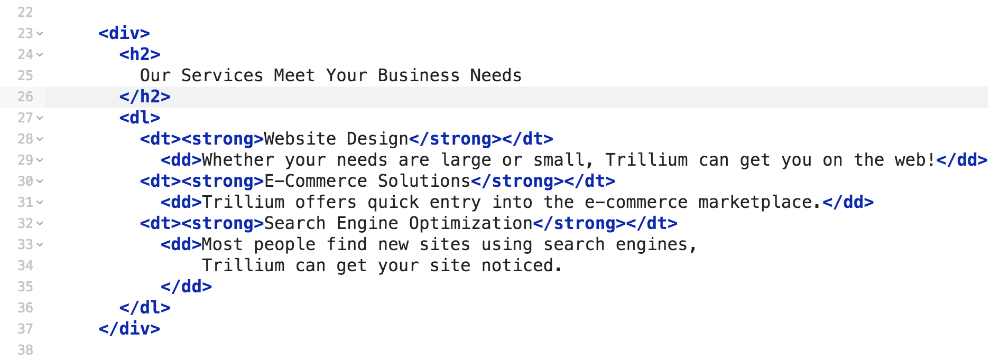
   
   - Your page should look like this: 
   
   
3. Create the Contact Page by clicking the three dots next to `services.html` and selecting `Duplicate` 
  - Rename it to contact.html and click OK
  
  - Modify the title to "Trillium Media Design - Contact" 
  
  - Delete the code between the opening and closing div tag and replace it with: 
  
  
  - Your page should look like this:
  
  
## Part Four: Javajam Challenge

You are creating a website for a Coffee House. Make 4 pages like the following (you'll need to create a new project in Glitch) 

## index.html 

## menu.html

## music.html

## jobs.html

## Part Five: Trillium Mini Challenge 

See if you can update your Trillium home page to look like the picture below:  
**Hint**: You will need an unordered list similar to the Trillium Contact Page and the JavaJam homepage
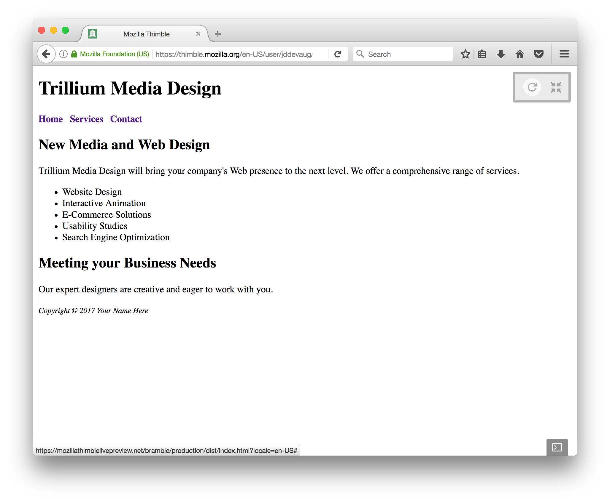

We are now going to use CSS (Cascading Style Sheets) to make our webpage more appealing. 

1. Create a new file. Save it and name it `trillium.css`. 

2. Add a link to your new `trillium.css` in your HTML files. This allows your HTML to "see" the CSS and apply the changes. 
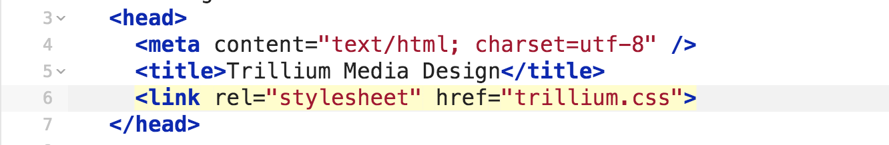

3. Add these styles to your into your trillium.css file:

Your webpage should look like this now:
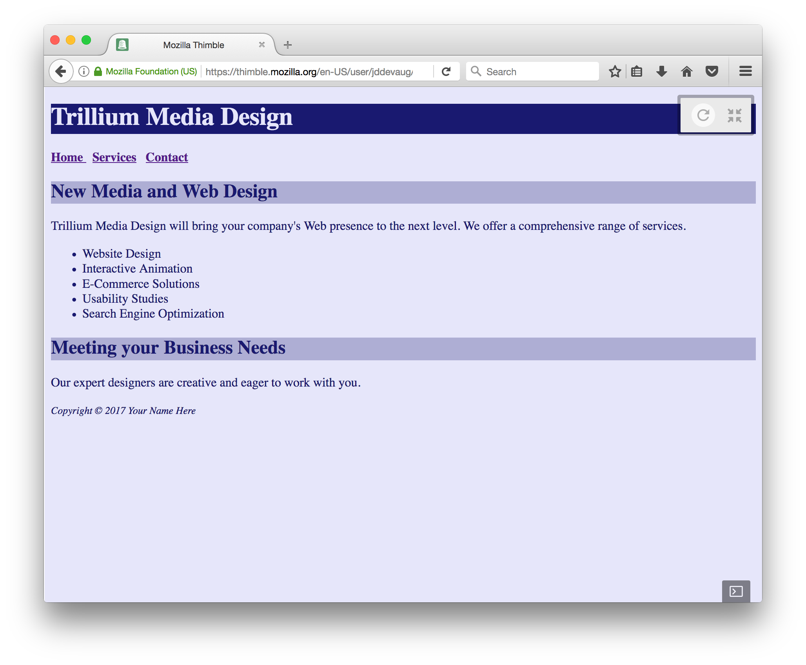

## Part Six: Classes and IDs

### Configure the CSS

4. Create a class name `feature` that configures red (#FF0000) text. Add the following code **TO THE BOTTOM** of your `trillium.css` file:
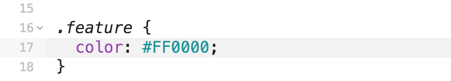

Classes are used to configure multiple html elements 

5. Create an id named `content` that configures an off-white background color. Add the following code **TO THE BOTTOM** of your `trillium.css` file:
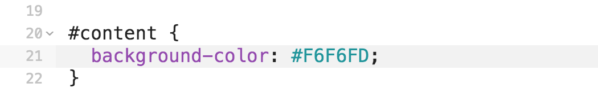

IDs are used to configure a **SINGLE** html element

### Configure the HTML

**CHANGES 6 AND 7 GO INSIDE YOUR HTML**

6. Modify the last two `<li>` tags in the unordered list. Add a class attribute that associates the `<li>` with the `feature` class. 

7. Modify the opening div tag (located below the closing nav tag). Add an id attribute that associates the div with the id named `content`:
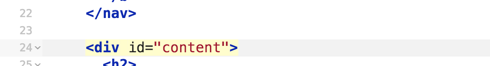

### Span 

8. Create a class name `companyName` that will configure the color of our company name in our paragraph. Remember to put it at the bottom of your CSS file. 
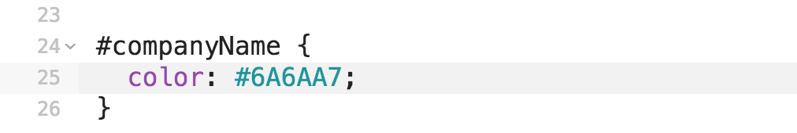

9. Now modify our paragraph **in your HTML file** so that our company name is now associated with it's class. 
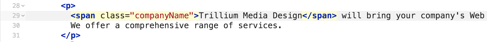

### One Last Tweak 
I don't like the space between the header and the nav bar. Let's adjust the margin so that they're closer. Modify the h1 selector in your CSS file to look like this:

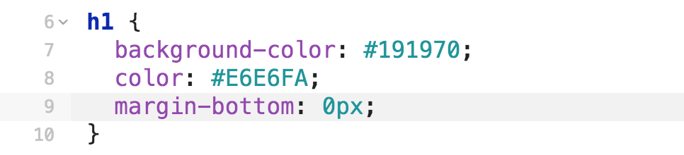

Your page should now look like this:
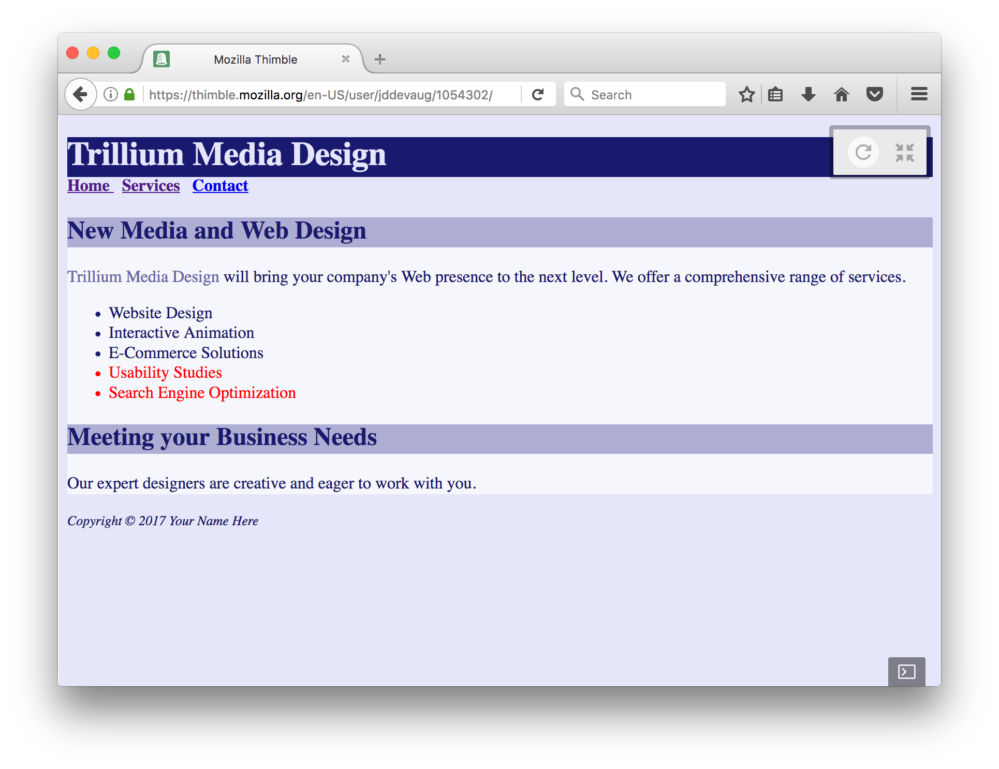

Great job! Move on to JavaJam Challenge Part II

## Part Seven: JavaJam Challenge Part II

### index.html

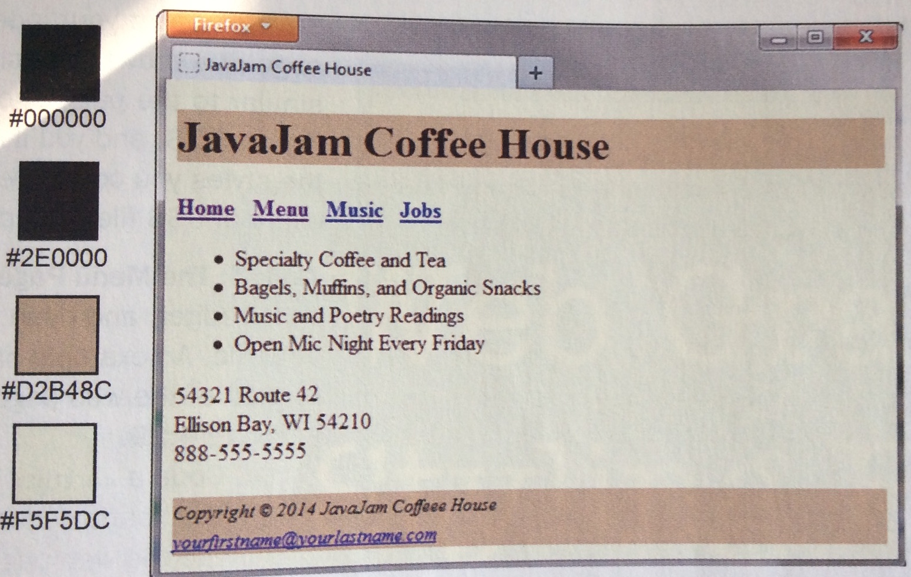

### jobs.html

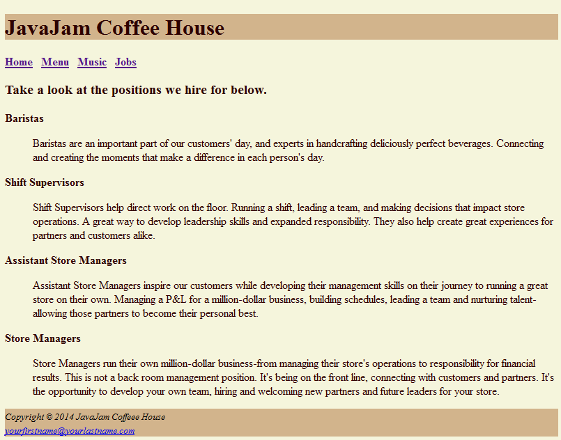

### music.html

Note that the performer links are external urls. include:  target="_blank" in the anchor tag
so that the performer link opens in a new window. [Here](https://www.w3schools.com/tags/att_a_target.asp) goes instructions on how to do that. 

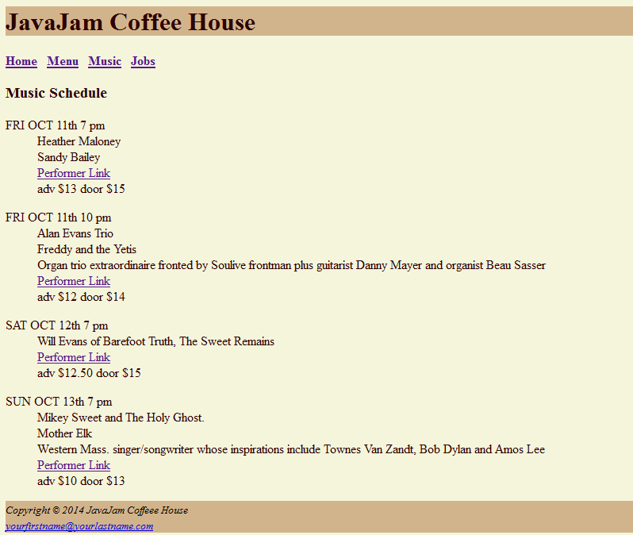

